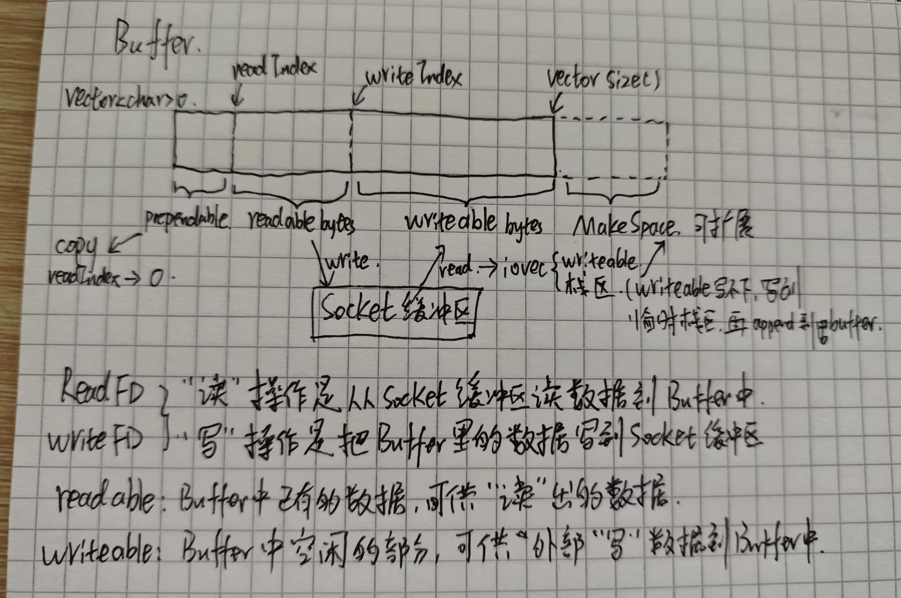

# Buffer缓冲区
Buffer类的设计源自陈硕大佬的muduo网络库，因为使用非阻塞I/O模型，没发完的数据要用一个容器进行接收，所以必须要实现应用层缓冲区。

### 主要实现方法
从socket读取来自client的消息数据和将响应数据发送到socket都需要有一个缓冲区来存储数据，这里我们以`vector<char>`作为底层存储实体，在上面封装一层我们自己的方法来满足读写的需求
- ReadFd
  从socket读数据到buffer缓冲区，然后http类会解析这个数据，读数据时用readv分散读到iov[2]，iov[0]地址是buffer的writeIndex，也就是writeable区域，iov[1]的地址是一块临时的栈空间，当buffer的writeable不能容纳整个消息数据时，剩余数据会读到临时栈空间里，后续再通过makespace函数，将栈空间的数据append到writeable区末尾
- WriteFd
  将http类构造好的消息数据发送到socket，这里有两种实现方法，一种是通过writev分散写，将响应消息的头部和正文分开使用iov[2]发送，一种是通过write/send循环发送，这里使用了后者
- readIndex/writeIndex
  写指针和读指针的下标，这里需要区分的是，readIndex是buffer内已有数据的起始指针，writeIndex是buffer内空闲部分的起始指针