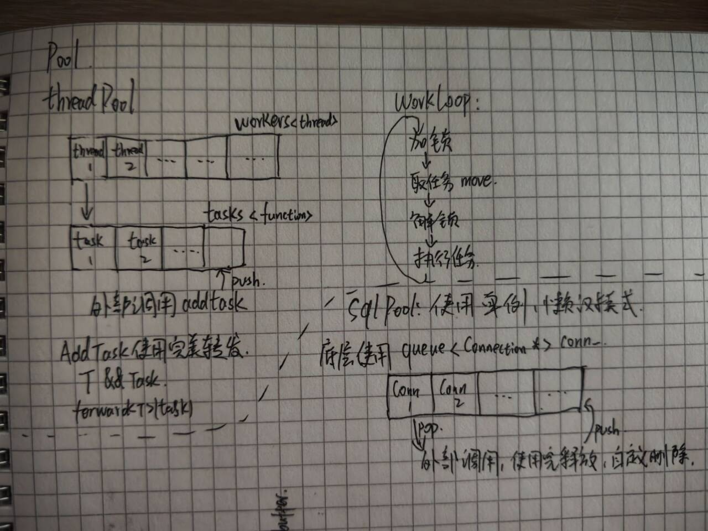

# 线程池和连接池

### 线程池
线程池有两个队列，一个是工作队列，使用vector实现，每一个vector元素都是一个线程，用来处理任务队列中的任务，另一个就是任务队列，使用queue实现，每一个元素都是一个function。
外部调用`AddTask`函数来添加一个任务，函数参数是一个lambda表达式，在类型推导时T会被推导为lambda的闭包类型，T&&成为右值引用，函数内部通过forward转发后仍然是右值引用，触发移动构造，避免了复制
workloop中，使用锁+条件变量实现对任务队列的访问，保证同一个任务不会被多个线程获取
### 数据库连接池
数据库连接池底层使用queue数据结构，每一个元素都是一个`sql::Connection`的指针，通过init提前创建好sqlnum条连接，外部需要使用时调用`GetSqlConnection`来获取一条连接，此时队列会pop头部的一条连接，待外部使用完后，不会真的释放这条连接，而是通过自定义删除器将这条连接再push到队列尾部，无需手动管理，符合RAII原则
- 自定义删除器
  `using ConnectionPtr = std::unique_ptr<sql::Connection, std::function<void(sql::Connection *)>>;`
  使用unique_ptr智能指针，外部调用时实际得到的是一个unique_ptr，无需手动管理sql资源，当生命周期结束后，会自动调用自定义删除器`std::function`