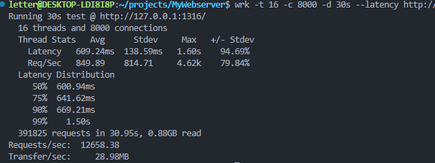

### 0、项目结构
```
.
├── code           源代码
│   ├── buffer     读写缓冲区
│   ├── http       http响应、解析
│   ├── log        异步日志
│   ├── pool       线程池、连接池
│   ├── server     Reactor+Epoll
│   ├── timer      定时器
│   └── main.cpp
|
├── resource       静态资源
│   ├── xxx.html
│   ├── picture
│   ├── video
│   ├── js
│   └── css
├── bin            可执行文件
│   └── main
├── imgs           readme中的图片
├── log            日志文件
├── Makefile
└── readme.md
```

### 1、build
下载mysql开发库
```shell
# C++ mysql开发库
sudo apt install libmysqlcppconn-dev -y
# mysql
sudo apt install mysql-server
```
mysql配置
```sql
CREATE DATABASE webserverdb;
USE webserverdb;
CREATE TABLE user(
    username char(50) NULL,
    password char(50) NULL,
    email    char(50) NULL
);
```
编译运行
```shell
make
./bin/main
```

### 2、Test
```shell
sudo apt install wrk
wrk -t 16 -c 5000 -d 30s --latency http://ip:port/
# 参数：
# 	-t 表示使用线程数
# 	-c 表示客户端连接数量
#   -d 表示时间
```
